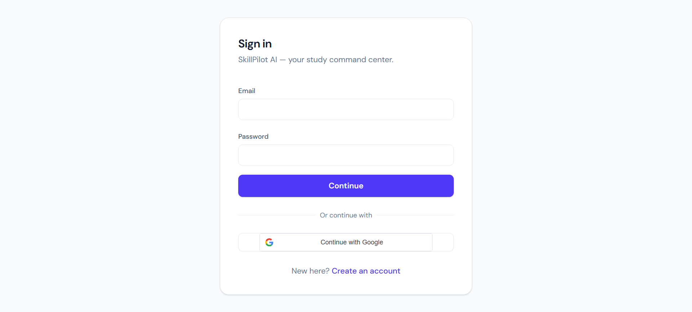
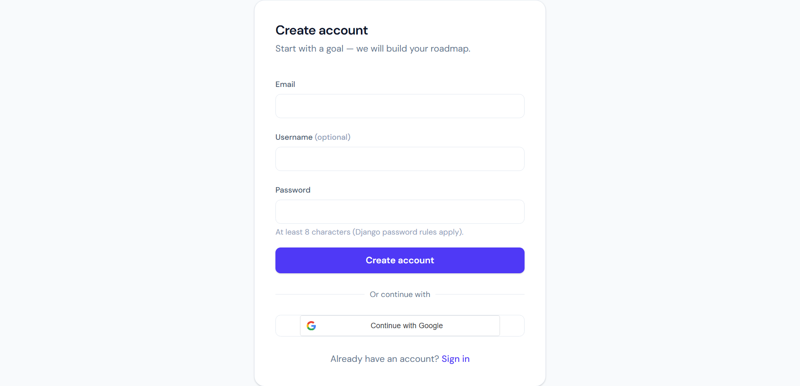
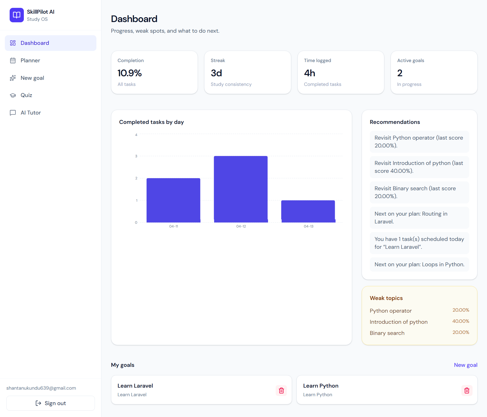
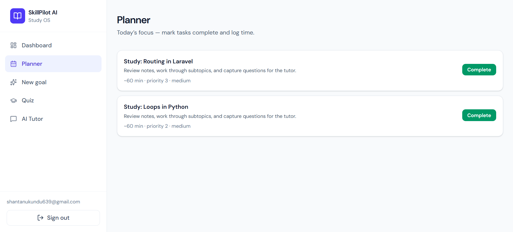
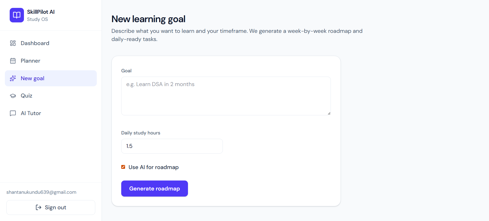
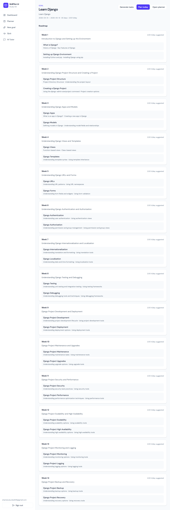
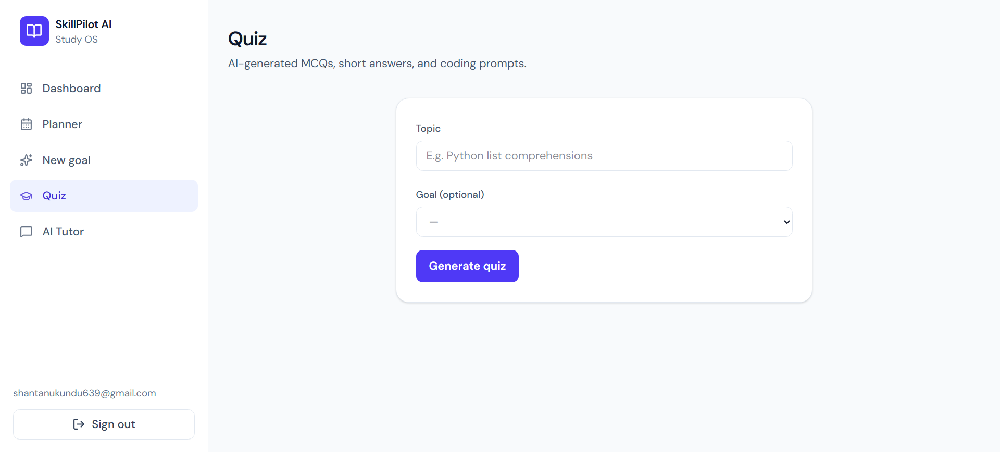
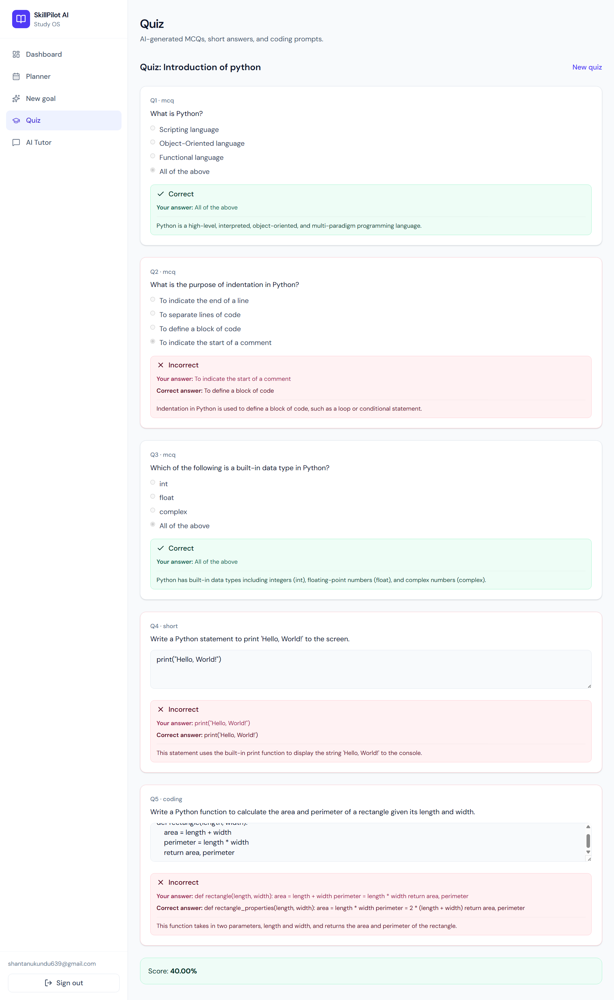
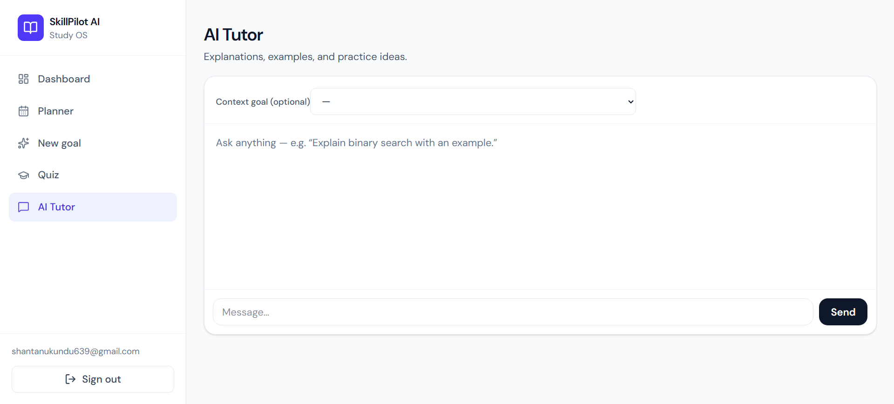
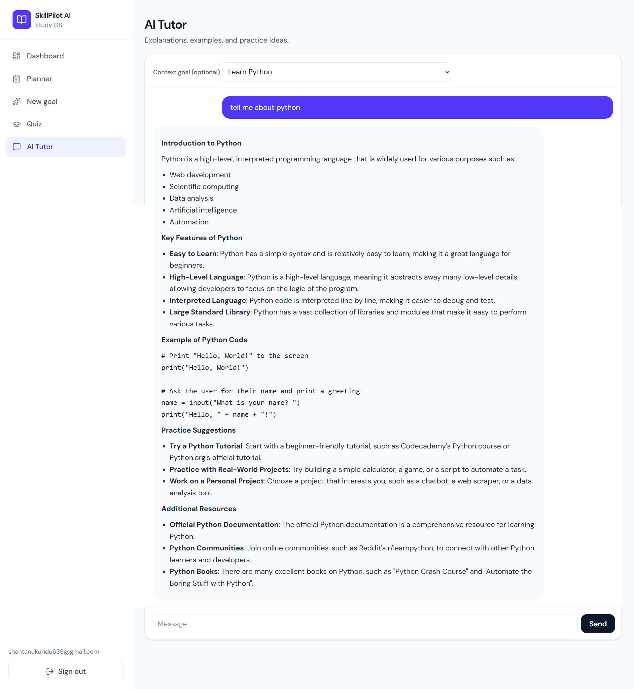

# SkillPilot-AI
SkillPilot AI is an intelligent learning management system (LMS) designed to help students learn anything efficiently with structured roadmaps, AI-powered tutoring, quizzes, and progress tracking.  It transforms vague learning goals into clear, actionable plans — making self-learning more organized, measurable, and engaging.

---

## ✨ Features

### 🎯 Goal-Based Learning
- Set a learning goal (e.g., *"Learn Django in 2 months"*)
- Automatically generates a **week-by-week roadmap**
- Structured topics and subtopics for clarity

### 📅 Smart Study Planner
- Daily task generation with estimated time
- Task completion tracking
- Priority-based scheduling

### 🤖 AI Tutor
- Ask anything related to your learning goal
- Get explanations, examples, and practice ideas
- Context-aware responses based on your goal

### 🧠 AI Quiz System
- Auto-generated MCQs, short answers, and coding questions
- Instant feedback with explanations
- Performance scoring and evaluation

### 📊 Progress Dashboard
- Track completion percentage
- Study streak tracking
- Time spent learning
- Weak topic identification
- Personalized recommendations

### 🔐 Authentication System
- Secure login & registration
- Google OAuth integration

---

## 🧠 AI Integration

This project leverages **Grok API** to power:

- AI Tutor (chat-based learning)
- Quiz generation
- Smart roadmap creation

---

## 🖼️ Screenshots

### 🔐 Authentication

  

  

---

### 📊 Dashboard

  

---

### 📅 Planner

  

---

### 🎯 Goal & Roadmap

  

  

---

### 🧠 Quiz System

  

  

---

### 🤖 AI Tutor

  

  

---

## 🏗️ Tech Stack

### Frontend
- React.js
- Tailwind CSS
- Axios

### Backend
- Django
- Django REST Framework (DRF)

### AI Integration
- Grok API

### Authentication
- JWT Authentication
- Google OAuth

---

## 🤝 Contributing

Contributions are welcome!

1. Fork the repository
2. Create a feature branch
3. Commit your changes
4. Open a pull request

---

## 📄 License

This project is licensed under the **MIT License**.

---

## 👨‍💻 Author

**Shantanu Kundu**
Full Stack Developer (Django + React)
Passionate about building AI-powered applications

---

## ⭐ Support

If you find this project useful, consider giving it a ⭐ on GitHub!
